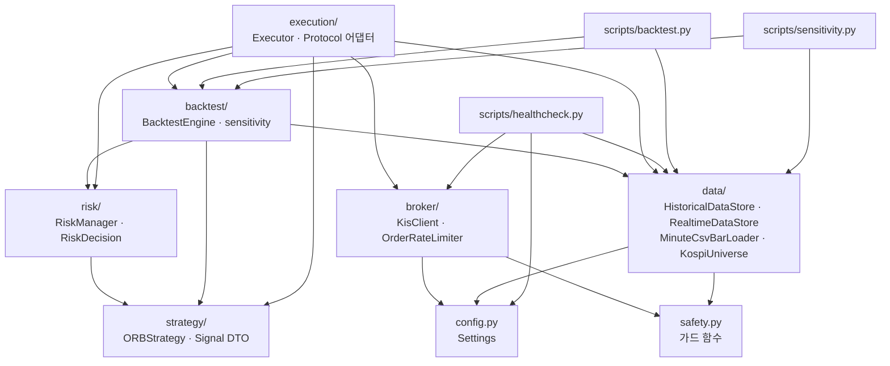
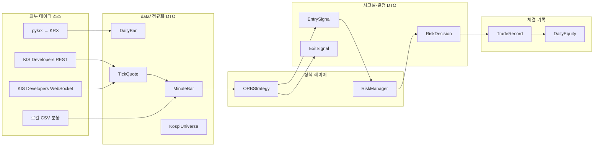
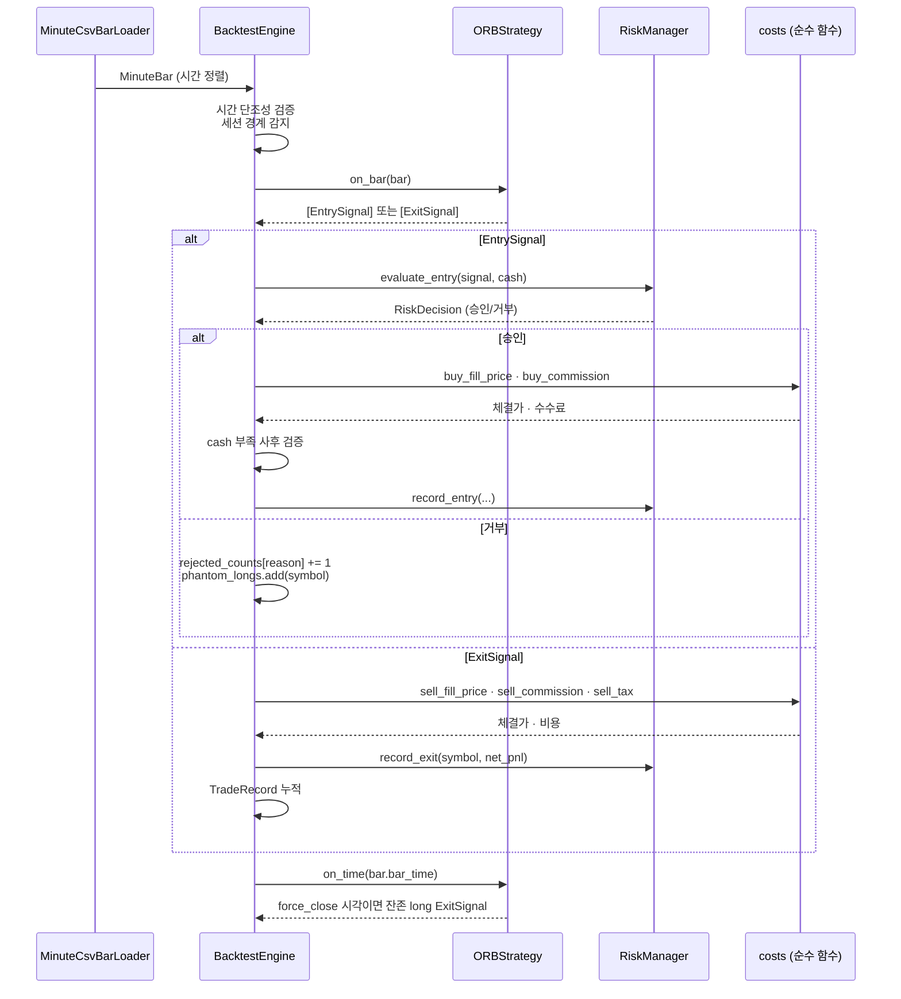
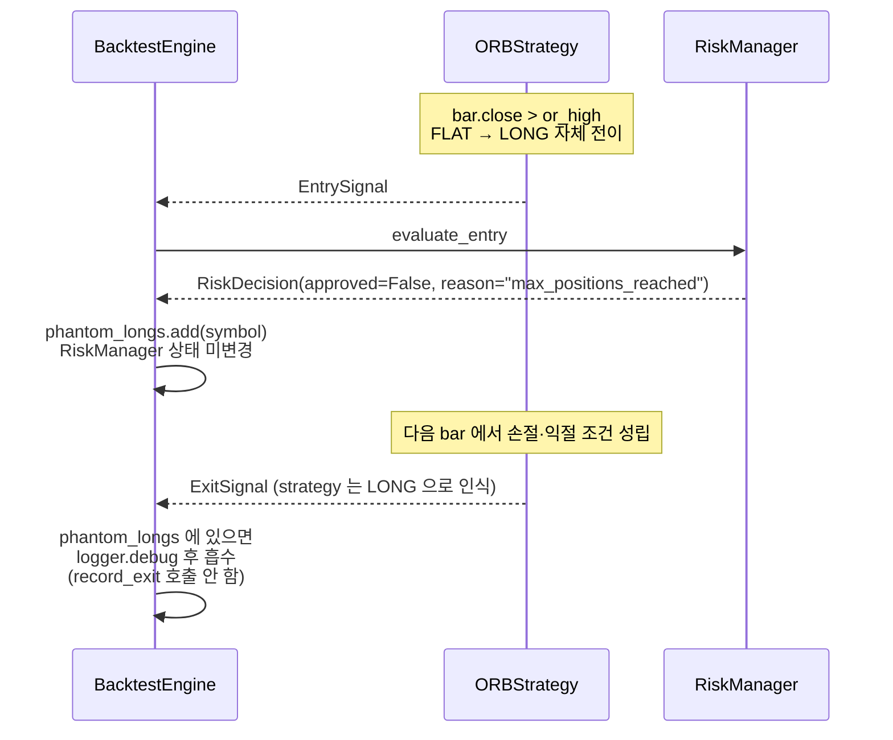

# stock-agent 기술 아키텍처

이 문서는 stock-agent 의 **기술적 모듈 상호작용** 을 한 자리에서 조망한다. 모듈 의존 그래프·데이터 흐름·DTO 계약·실행 시나리오·비용 모델·테스트 전략을 다루며, 각 모듈의 세부 공개 API 와 운영 정책은 모듈별 `CLAUDE.md` 에 위임한다.

> 이 문서는 **구조와 계약**을 다룬다. 값(파라미터·테스트 케이스 수·Phase 상태)이 자주 바뀌는 항목은 정본 문서로 링크만 제공한다.
>
> - 외부 개요·면책: [README.md](../README.md)
> - 비즈니스 결정·전략 규칙·PASS 기준: [plan.md](../plan.md)
> - Claude 작업 지침·Phase 상태·동기화 정책: [CLAUDE.md](../CLAUDE.md)
> - 아키텍처 결정 근거(ADR): [docs/adr/](./adr/README.md)
>
> **PRD 부재 명시**: 본 프로젝트는 본인 자본으로 본인이 운영하는 단일 사용자 시스템이라 별도 PRD 를 두지 않는다. 제품 요구사항(전략 규칙·리스크 한도·Phase별 PASS 기준) 은 [plan.md](../plan.md) 가 담당한다.

---

## 1. 개요

stock-agent 는 한국투자증권 KIS Developers API 를 기반으로 한 **Python 3.12+ 데이트레이딩 자동매매** 시스템이다. 기술적 정체성은 다음 세 가지로 요약된다.

1. **계층화된 단방향 의존** — `data → strategy → risk → backtest/execution` 순서. 순환 의존 0건.
2. **외부 I/O 격리** — 네트워크·파일·시계 의존은 경계 모듈(`broker`, `data`)에만 두고, 정책 모듈(`strategy`, `risk`, `backtest`)은 순수 로직.
3. **DTO 정규화** — 외부 라이브러리(`python-kis`, `pykrx`) 의 raw 타입을 상위 레이어로 절대 누출하지 않는다. 모든 모듈 경계에서 `@dataclass(frozen=True, slots=True)` DTO 로 변환.

---

## 2. 디렉토리 구조

```
korean-stock-trading-system/
├── src/stock_agent/
│   ├── config.py              # pydantic Settings (KIS/텔레그램 환경변수)
│   ├── safety.py              # install_paper_mode_guard / install_order_block_guard
│   ├── broker/                # KIS API 래퍼  → CLAUDE.md
│   ├── data/                  # 시장 데이터·유니버스  → CLAUDE.md
│   ├── strategy/              # ORB 전략 엔진  → CLAUDE.md
│   ├── risk/                  # 리스크 매니저  → CLAUDE.md
│   ├── backtest/              # 백테스트 엔진·민감도  → CLAUDE.md
│   ├── execution/             # Executor 오케스트레이션  → CLAUDE.md
│   └── main.py                # 장중 실행 진입점 (BlockingScheduler + Executor 오케스트레이터)
├── scripts/                   # CLI 진입점 3종
│   ├── healthcheck.py         # KIS 모의 잔고·실시간 시세·텔레그램 확인
│   ├── backtest.py            # 단일 런 백테스트 (CSV 분봉 입력)
│   └── sensitivity.py         # 파라미터 민감도 32 조합 그리드
├── tests/                     # pytest (외부 I/O 100% 목킹)
├── config/universe.yaml       # KOSPI 200 유니버스 (수동 관리)
├── .github/workflows/ci.yml   # ruff + black + pytest
└── pyproject.toml             # uv 의존성 관리
```

각 모듈의 공개 심볼·설계 원칙·테스트 정책은 모듈별 `CLAUDE.md` 가 정본이다.

- [src/stock_agent/broker/CLAUDE.md](../src/stock_agent/broker/CLAUDE.md)
- [src/stock_agent/data/CLAUDE.md](../src/stock_agent/data/CLAUDE.md)
- [src/stock_agent/strategy/CLAUDE.md](../src/stock_agent/strategy/CLAUDE.md)
- [src/stock_agent/risk/CLAUDE.md](../src/stock_agent/risk/CLAUDE.md)
- [src/stock_agent/backtest/CLAUDE.md](../src/stock_agent/backtest/CLAUDE.md)
- [src/stock_agent/execution/CLAUDE.md](../src/stock_agent/execution/CLAUDE.md)

---

## 3. 모듈 의존 그래프



**규약**:
- 화살표 방향 = "import 한다" (의존). 역방향 import 는 없다.
- `strategy`, `risk`, `backtest` 는 외부 라이브러리(`python-kis`, `pykrx`) 를 직접 import 하지 않는다 — 정책 모듈은 순수 로직.
- 순환 의존 0건. 새 모듈 추가 시 이 단방향 계층을 깨지 않도록 주의.

---

## 4. 데이터 흐름 및 DTO 계약



### DTO 계약 표

| DTO | 정의 모듈 | 핵심 필드 | 불변성 |
|---|---|---|---|
| `DailyBar` | `data.historical` | `symbol`, `trade_date`, `open/high/low/close: Decimal`, `volume: int` | `frozen=True, slots=True` |
| `TickQuote` | `data.realtime` | `symbol`, `price: Decimal`, `ts: datetime` (KST aware) | `frozen=True, slots=True` |
| `MinuteBar` | `data.realtime` | `symbol`, `bar_time: datetime`, `open/high/low/close: Decimal`, `volume: int` | `frozen=True, slots=True` |
| `KospiUniverse` | `data.universe` | `as_of_date: date`, `source: str`, `tickers: tuple[str, ...]` | `frozen=True, slots=True` |
| `EntrySignal` | `strategy.base` | `symbol`, `price: Decimal`, `ts`, `stop_price`, `take_price` | `frozen=True, slots=True` |
| `ExitSignal` | `strategy.base` | `symbol`, `price: Decimal`, `ts`, `reason: ExitReason` | `frozen=True, slots=True` |
| `RiskDecision` | `risk.manager` | `approved: bool`, `qty: int`, `reject_reason`, `target_notional_krw` | `frozen=True, slots=True` |
| `PositionRecord` | `risk.manager` | `symbol`, `entry_price`, `qty`, `entry_ts` | `frozen=True, slots=True` |
| `TradeRecord` | `backtest.engine` | `entry/exit` 각각의 `ts`, `price`, `gross/commission/tax/net_pnl_krw` | `frozen=True, slots=True` |
| `DailyEquity` | `backtest.engine` | `session_date`, `cash_krw` | `frozen=True, slots=True` |

### `BarLoader` Protocol 재호출 안전 계약

`backtest.loader.BarLoader` 는 `stream(start, end, symbols) -> Iterable[MinuteBar]` 를 정의한다. **동일 인자로 여러 번 호출하면 매번 새 Iterable 을 반환해야 한다** — `sensitivity.run_sensitivity` 가 파라미터 조합마다 재호출하기 때문. 1회 소비 iterator 공유는 계약 위반이다. 두 구현체(`InMemoryBarLoader`, `MinuteCsvBarLoader`) 모두 이 계약을 준수한다.

### 시그널 가격 필드의 의미

`EntrySignal.price` / `ExitSignal.price` 는 **참고가**다. 백테스트 엔진은 이를 슬리피지 모델로 보정해 체결가를 계산하고, 실시간 executor(Phase 3)는 실제 체결가로 덮어써야 한다. 호가 단위 라운딩은 strategy 레이어 책임 밖이다.

---

## 5. 실행 시나리오

### 5.1 백테스트 1 bar 처리



진입점 코드:
- `src/stock_agent/backtest/engine.py` — 메인 루프
- `src/stock_agent/strategy/orb.py` — `on_bar` / `on_time` 상태 머신
- `src/stock_agent/risk/manager.py` — `evaluate_entry` 6단계 게이팅
- `src/stock_agent/backtest/costs.py` — 순수 비용 함수

### 5.2 phantom_long 흐름 (RiskManager 거부 시 후속 ExitSignal 흡수)



**왜 필요한가**: `ORBStrategy._enter_long` 은 `EntrySignal` 을 반환하기 전에 자체 상태(`position_state="long"`)를 전이시킨다. RiskManager 가 거부해도 strategy 는 LONG 으로 알고 후속 ExitSignal 을 만든다. 엔진은 `phantom_longs: set[str]` 으로 이 가짜 LONG 을 추적해 후속 ExitSignal 을 silent 로 흡수한다 — RiskManager 는 진입 자체를 모르므로 record_exit 을 호출하면 무결성 위반.

---

## 6. 한국 시장 비용 모델

| 비용 항목 | 비율 | 적용 시점 | 근거 코드 |
|---|---|---|---|
| 슬리피지 | 0.1% (불리) | 시장가 매수·매도 모두 | `BacktestConfig.slippage_rate` |
| 수수료 | 0.015% | 매수·매도 대칭 (KIS 한투 비대면 기준) | `costs.buy_commission` / `sell_commission` |
| 거래세 | 0.18% | **매도만** (KRX 2026-04 기준) | `costs.sell_tax` |

위 수치는 `BacktestConfig` 기본값이다. 변경 근거 및 비대칭 거래세의 영향 분석은 [plan.md](../plan.md) 의 비용 결정 섹션을 참조한다.

---

## 7. 외부 I/O 경계

### KIS API 두 도메인 키 분리

| 용도 | 환경변수 | 도메인 |
|---|---|---|
| 주문·잔고 | `KIS_APP_KEY`, `KIS_APP_SECRET`, `KIS_ACCOUNT_NO` (paper) | KIS paper 도메인 |
| 시세 (REST/WebSocket) | `KIS_LIVE_APP_KEY`, `KIS_LIVE_APP_SECRET`, `KIS_LIVE_ACCOUNT_NO` | KIS 실전 도메인 |

이유: KIS paper 도메인에 `/quotations/*` 시세 API 가 없다. 실시간 체결가는 실전 키로 실전 도메인을 직접 호출해야 한다. KIS Developers 포털에서 실전 앱을 별도 신청하고 **사용 IP 를 화이트리스트에 등록**해야 한다 (미등록 시 `EGW00123` 계열 오류).

### 안전 가드 두 종류

`src/stock_agent/safety.py` 에 정의된다.

| 가드 | 설치 시점 | 차단 대상 |
|---|---|---|
| `install_paper_mode_guard` | `KisClient` 생성 시 (paper 모드 한정) | paper 환경에서 `request(domain="real")` 의 주문 경로(`/trading/order` 부분 문자열 매칭). 조회 경로(`/quotations/*`)는 통과. |
| `install_order_block_guard` | `RealtimeDataStore._build_pykis` (실전 키 PyKis 인스턴스 생성 시) | `/trading/order*` 를 **도메인 무관** 차단. "시세 전용" 인스턴스임을 구조적으로 보장. |

두 가드는 모두 `GUARD_MARKER_ATTR` 로 중복 설치를 거부해 idempotent.

---

## 8. 테스트 전략 및 격리

### 외부 의존 100% 목킹 원칙

| 외부 의존 | 격리 방식 |
|---|---|
| KIS API (`python-kis`) | `pykis_factory: Callable` 주입으로 `MagicMock` 반환 — 실제 import 도 차단 |
| pykrx | `pykrx_factory` 주입으로 `MagicMock` 반환. DataFrame 은 실제 pandas 로 경량 더블 생성 |
| 텔레그램 봇 | `python-telegram-bot` API 객체 mock |
| 시계 (`datetime.now`) | `clock: Callable[[], datetime]` 주입 |
| 파일·DB | `tmp_path` fixture 또는 `":memory:"` SQLite |

`strategy`, `risk`, `backtest` 는 순수 로직이라 외부 목킹이 필요 없다. 합성 fixture 만으로 테스트 가능.

### 테스트 작성 강제 정책

`tests/` 하위 Python 파일의 생성·수정은 **반드시 `unit-test-writer` 서브에이전트를 경유**한다. 메인 assistant 의 직접 `Write`/`Edit`/`NotebookEdit` 은 [.claude/hooks/tests-writer-guard.sh](../.claude/hooks/tests-writer-guard.sh) 가 `PreToolUse` 단계에서 exit 2 로 차단한다. 목적: 실주문·실네트워크 접촉을 원천 차단.

### CI 파이프라인

[.github/workflows/ci.yml](../.github/workflows/ci.yml) — PR 및 main push 시 다음 순서로 실행:

1. `uv sync --frozen` — 의존성 동기화 (uv.lock 고정)
2. `uv run ruff check src scripts tests` — 린트
3. `uv run ruff format --check src scripts tests` — 포맷 검사
4. `uv run black --check src scripts tests` — 포맷 검사 (이중)
5. `uv run pytest -v` — 테스트 전체 실행

main 브랜치 보호: required status check `Lint, format, test` 통과 필수, force push/삭제 금지. 정확한 테스트 케이스 수와 모듈별 분포는 [CLAUDE.md](../CLAUDE.md) 의 "현재 상태" 섹션을 참조 (값은 자주 바뀐다).

---

## 9. 진입점 카탈로그

| 스크립트 | 역할 | 필수 인자 | 의존 모듈 |
|---|---|---|---|
| `scripts/healthcheck.py` | KIS 모의 잔고 + 실시간 시세(선택) + 텔레그램 알림 확인 | 없음 (`.env` 로드) | `broker`, `data`, `config` |
| `scripts/backtest.py` | CSV 분봉 입력 → 단일 런 백테스트 → Markdown/메트릭 CSV/체결 CSV 3종 산출 | `--csv-dir`, `--from`, `--to` | `backtest`, `data`, `config` |
| `scripts/sensitivity.py` | 파라미터 민감도 32 조합 그리드 → Markdown/CSV 산출 | `--csv-dir`, `--from`, `--to` | `backtest`, `data`, `config` |
| `python -m stock_agent.main` | 장중 자동매매 실행 — BlockingScheduler + Executor 오케스트레이터 | 없음 (선택: `--dry-run`, `--starting-capital`, `--universe-path`, `--log-dir`) | `execution`, `strategy`, `risk`, `broker`, `data`, `config` |

### 장중 실행 오케스트레이터 (main.py)

`src/stock_agent/main.py` 는 모든 모듈을 조립해 장중 자동매매를 실행하는 단일 진입점이다.

```
BlockingScheduler(timezone=Asia/Seoul, day_of_week=mon-fri)
  ├── 09:00  on_session_start — 잔고 조회 → min(CLI 자본, 잔고 total) 로 Executor.start_session
  ├── 매분   on_step          — Executor.step(now): reconcile → on_bar → on_time
  ├── 15:00  on_force_close   — Executor.force_close_all(now)
  └── 15:30  on_daily_report  — 당일 PnL·진입수·활성 포지션 로그 (텔레그램은 후속 PR)

Protocol wiring (build_runtime):
  RealtimeDataStore  → BarSource
  LiveOrderSubmitter | DryRunOrderSubmitter  → OrderSubmitter  (--dry-run 플래그로 선택)
  LiveBalanceProvider  → BalanceProvider

리소스 정리:
  SIGINT/SIGTERM → _graceful_shutdown → scheduler.shutdown(wait=False)
                → realtime_store.close() → kis_client.close()
  finally 블록에서 중복 close 호출 (멱등)
```

**공휴일 처리**: cron `day_of_week='mon-fri'` 만 적용. KRX 임시공휴일은 운영자가 프로세스를 띄우지 않는 방식으로 처리 (ADR-0011).

### exit code 규약

| 코드 | 의미 |
|---|---|
| `0` | 정상 종료 (SIGINT/SIGTERM/KeyboardInterrupt 포함) |
| `1` | 예기치 않은 런타임 예외 (`main.py` 스케줄러 루프 한정) |
| `2` | 입력·설정 오류 (`MinuteCsvLoadError`, `UniverseLoadError`, `RuntimeError`) |
| `3` | I/O 오류 (`OSError`) |
| 기타 | Python 기본 traceback 으로 전파 (버그로 간주) |

`scripts/backtest.py` 의 PASS/FAIL 라벨은 **리포트에만 기록되고 exit code 에 반영되지 않는다** — CI 자동 pass/fail 금지 (운영자 수동 검토 보존).

---

## 10. 현재 상태 및 미구현 영역

Phase 진행 상태와 구체적 산출물은 [CLAUDE.md](../CLAUDE.md) 의 "현재 상태" 섹션이 정본이다. 본 문서는 **구조적으로 어디에 무엇이 비어 있는지** 만 기록한다.

### 미구현 모듈 (Phase 3+)

| 예상 경로 | 역할 | Phase |
|---|---|---|
| `src/stock_agent/execution/` | 장중 실시간 루프, 주문 송수신, 체결 추적 | **완료 2026-04-21 (코드·테스트 레벨)** |
| `src/stock_agent/main.py` | 장중 실행 진입점 (BlockingScheduler + Executor 오케스트레이터) | **완료 2026-04-21 (코드·테스트 레벨)** |
| `src/stock_agent/monitor/` | 포지션 추적, 텔레그램 알림 라우팅 | Phase 3 (미착수) |
| `src/stock_agent/storage/` | 체결·주문 영속화 (SQLite) | Phase 3 (미착수) |
| `src/stock_agent/data/` 의 KIS 과거 분봉 어댑터 | KIS 과거 분봉 API 어댑터 (현재 CSV 만 지원) | 별도 PR |

### 미완료 검증

- 장중 실시간 시세 수신 end-to-end 확인 (실전 키 + IP 화이트리스트 + 평일 장중) — **통과 완료 (2026-04-21)**
- 2~3년 실데이터 기반 낙폭 절대값 15% 미만 (MDD > -15%) 수동 확인 — Phase 2 잔여
- Phase 3 모의투자 2주 무사고 운영 — 실전 전환 전제

---

## 이 문서의 사실관계 책임 경계

본 문서는 **시스템 구조와 모듈 간 계약** 만 다룬다. 다음 항목들은 정본 문서가 따로 있으므로 본 문서에는 값을 박지 않는다.

| 사실 | 정본 문서 |
|---|---|
| 모듈별 공개 API 전체 목록 | 모듈별 `CLAUDE.md` |
| Phase 진행 상태·테스트 케이스 수·의존성 버전 | [CLAUDE.md](../CLAUDE.md) |
| 전략 파라미터 기본값·리스크 한도 수치 | [plan.md](../plan.md) + 모듈별 `CLAUDE.md` |
| PASS 기준·실전 전환 게이트 | [plan.md](../plan.md) |
| 외부 사용자 안내·면책 | [README.md](../README.md) |
| 아키텍처 결정 근거(왜 이 선택을 했는가) | [docs/adr/NNNN-*.md](./adr/README.md) |

따라서 전략 파라미터나 Phase 상태가 바뀌어도 본 문서의 갱신은 **불필요**하다. 본 문서를 갱신해야 하는 시점은 다음과 같다.

- 새 모듈 패키지가 추가되거나 기존 모듈이 분할·통합될 때 (의존 그래프 변경)
- 새 DTO 계약이 모듈 경계에 등장할 때 (DTO 표 갱신)
- 외부 I/O 경계 정책이 바뀔 때 (가드 함수, 키 분리 정책 등)
- 새 CLI 진입점이 `scripts/` 에 추가될 때
- exit code 규약이 변경될 때
